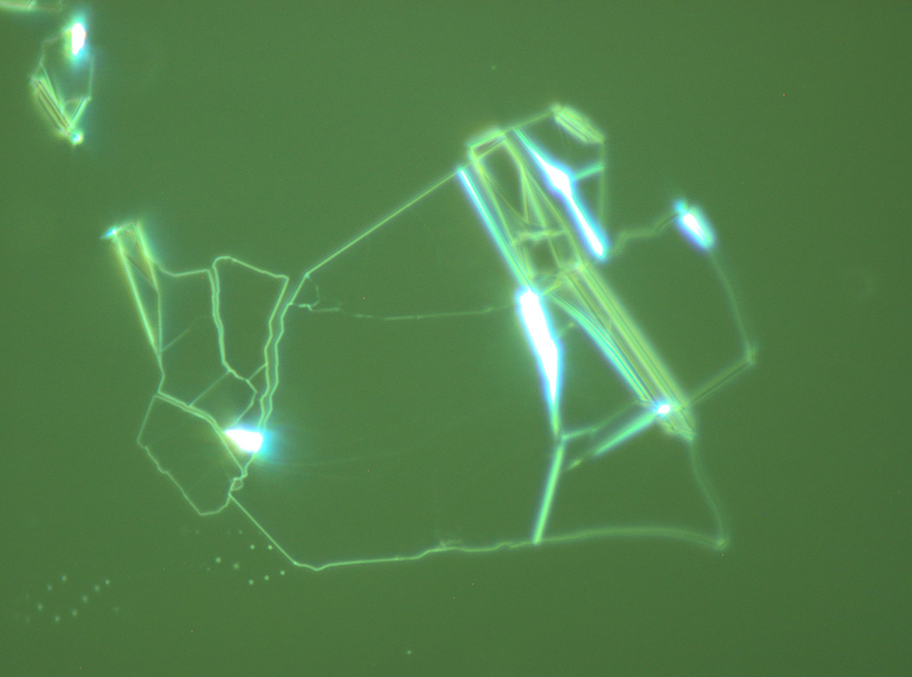

# Fabrication procedure
## **Exfoliation**
### hBN
Use doped Si (0.01-0.05 Ohm) (cheaper and bigger. Later when making device, we use intrinsic Si (higher R))
1. Cut Si into small pieces, ~2 * 2 inches (little scratch and use dice to give it a small force (touch the surface the less the better. If you feel it too hard to do, then there could a problem). Another way to do is using glass slides and tweezers. if dirty, use N2 gun to blow it (maybe no need to clean it using chemical)
2. Put remaining big Si substrate into patradish. Name it (name, date, from which box you get it)
3. Gel-pack. Two types: black and transparent. Number means how sticky it is. 我们用透明的 for exfloition
4. Tape: use 1009R tape (larger number means it is less sticky) 在大胶带上切一刀下来一小条 用尖头的镊子撕一薄层 剩下的装进自己的盒子
5. hBN: 在store box Group栏里 找盒子 里找shining 比较大的 的hBN（最好每次换着batch用，多一些variation）
6. keep一个mastertape 用不同胶带粘 粘到挺shine但又不那么shine （每一个成品大概经过了三次粘）
7. heater: 110度 把Si放到heater上的载玻片上 等一会儿热了后 再用胶带粘到上面 在hot plate上加热1min（整个处理过程中胶带最好不要starch 可能会带来strain）**不要压！ 轻轻除去bubble以及让tape和chip接触即可** (**仅TMD需要用tefelon tweezer以刚刚接触的力量轻轻压平**)
8. exfoliator: 首先 full step direction left speed8- engage 停下来后 如果不够还可以再往左移（送掉把手往左移，移好后再次拧紧），直到Si上的胶带可以粘到机器上 然后microstep direction right speed 2 先按auto-再按engage 会一直闪（如果不闪需要重启，重启时注意机器可能会突然右移，直接撕掉胶带. 最好让开始就开始撕，要不然浪费距离。exploiting过程会持续几个小时. 也可以用手撕掉胶带，但也要慢，持续1min左右

#### Liqiao's BN method
- crystal: shinny, flat surface, not too large not too small
- tape: 1007 (softer than 1009 and can cover the chips very smoothly when putting down the tape to the chips)
- 在一个tape上来回粘，不需要太过于考虑overlap与否; 如果觉得太厚，可以用tape整个再粘一次，留下original的，扔掉用来粘的那个. 最终tape上的crystal要dense一些
- 100C for 1min (Liqiao first heat the chips to 100C and then take the chips off the plate onto the Feb wipes and engage the tapes. Then put the chips to hot plate for 1min)
- 如果确实需要thin BN, exfoliator is better

#### Liqiao's method for picking up thin BN:
**reduce PDMS thickness**: 9.5, 0.5 or 9.3, 0.5
#### Shuwen's method for picking up thin BN
Most of the wrinkles in thin BN appear during the cooling down of PC.

- heat the chips to 60C, 70C, ..., 110C. See the lowest T to pick up BN.
- use motor to slowly engage, slowly disengage.
- When PC is totally off the chips, let them still be very close. Turn off the heater and let it cool down without any further inference (e.g., water cooling, fan...)

Some bad BN examples:
[avoid bad BNs](Experiment.md#avoid%20bad%20BNs)

#### Tips
**231130:** 
- hBN999: ~2次exfoliation的chip yield很高，虽然residue不少；~3次exfoliation的就几乎没有yield
- 用胶带之间对flake区域进行拼拼图一样的方式，来实现最少重叠的exfoliation

### Graphite (for top gates)
与hBN基本类似，有几点不同：
1. 用1007 tape
2. 用大片的 flaggy flakes graphite片子先用胶带粘出core，把core作为mastertape（由于最外面的那一层比较脏）
3. 反复胶带粘后，对着光看到一些透明（大面积透明）的flake就基本可以（对于graphite，在一个tape上反复粘甚至就可以）
4. heater 250度，将chip放上加热一段时间后，拿下来将tape粘上去即可 一个胶带贴一个chip
5. 不用exploiter，用手缓慢撕下来就可以
6. top gate graphite 不需要heat cleaning，否则不易PC pickup

**一些经验**
1. Olympus的界面可以用鼠标滚轮调节 使用前先调到全屏
2. 会发现在20x以上显示屏和显微镜显示颜色不同 应该在100x先调白平衡 之后显示颜色就一致了
### MoTe2 (Glove box)
1. 先转移到Gelfilm上 gelfilm撕掉软的那一层 然后贴到有flake的胶带上 用塑料镊子轻轻压平3-4次 快速撕下 在同一个胶带上用多几个gelfilm 重复上述过程
2. 将gelfilm贴到Si chip上 此时和chip接触的那一面是干净的面 然后再用塑料镊子轻轻压平
3. MoTe2即使在手套箱也会degrade 所以一旦打开就需要在12h内完成所有步骤，越快越好
4. Mono-bi-trilayer 都可以看出来

#### 231023
用甲苯浸泡Gelfilm后，作为最后一步exfoliate MoTe2，似乎显著减少了glue residual on MoTe2 surface.

### WSe2
1. 用1007 Tape
2. 平时WSe2保存在GB里，先取出来
3. exfoliation结束后，在microscope下看，不要太零碎，flake是大片大片的，呈现黄绿相间的颜色为佳 
4. Oxygen Plasma chips，之后尽快将WSe2贴上去，用teflon tweezer以刚刚接触的力量压平
5. 静置一天

monolayer WSe2主要存在于1. 厚flake边缘 2. 以及一些空旷区域，注意观察这些地方会提高hunting速度。在20x看是浅蓝色

## Heat cleaning
Ask for a new tube for heat cleaning
1. tube放到腔体后，旋钮往右转两圈 扣上（先做这一步，扣上很重要，否则后续tube容易倾倒）
2. Ar H2 if 内部气压 below 500， change it
3. 通气管口的圈先拧得差不多紧 扣到tube上 慢慢向里插，碰到后再返回一些（这样后续拧紧不容易拧碎tube）. 之后拧紧到基本拧不动
4. 先打开黄色把手 Ar40 H2 20. 5min之后需要check气压是否正确 一般需要再次调整!
5. 整个过程不要用手碰tube内boat（由于heat cleaning，这样可能会将杂物蒸发到sample上）。用手轻轻颠的办法移动boat。若拿出boat，垫一层铝箔纸。
### hBN program
350度 6h in Program2/3

先同时长按中间和右边进入调整界面
然后按中间/右边 找到level
按住左边+再按中间 进入P 按多则先按住左+再右 
右边 (enter)
继续右 to sec1（或sec2/3 先按住左+再中/右） type spr speed 30 Tsp350 eop none
左 加右 tosec2 type soak sine 360 eop none
左 加右 typeeop
runon-runoff 左+中间 再按中间+右（这是enter的意思）回去则成功 off-run调节类似

最后在吸气瓶看是否真的有气
在notebook上记录

结束后程序会自动关闭
拿下来时 先关两个flowmeter 再关黄把手
然后再取下来通气阀门 铝箔纸罩上放在桌面
再打开腔门

### Tube program
program3就是 只需要放到那里烤就可以，不需要通气体
Sec1: Speed 100 Tsp 1000
Sec 2: sine 60

**逻辑：**
中间+右边长按 = 确认/返回主页面/进入调节页面
中间/右边 前后移动按键 
右边 也有进入的意义 (进入Program, Level, Section...的内容)
按住左+中间/右边 在一个小门类 (Program, Level, Section...) 里调节

门类从大到小：一堆乱七八糟和level并列 level 1/2/3/A/P - enter level P - Program 1/2/3 - enter program 1/2/3 - 一堆乱七八糟的和Sec并列 (run on/off在其中), Sec 1/2/3 - 进入Sec 1/2/3

关键：以上都是按中/右键移动，乱七八糟和Sec123是并列的，Sec123后再右键是进入了Sec123的这个子门类
如果run是on 需要先将run挑为off (然后中+右长按确认并回到主界面，再中+右长按进入调节页面) 才能进行后续调节

[heat clean notes](Experiment.md#heat%20clean%20notes)

## flake hunting
1. Olumpus的界面使用（此处不小结了）
2. 在Si和Gelpak均标号，Si一般在Lower Left处标号，然后在microscope下先把这一角对准
3. 按一个顺序移动完整个Si
4. 对于hBN，从黄-绿-青-蓝-紫，厚度依次降低。我们此处希望的是至少青蓝/偏紫的flake；对于graphite作为gate，我们要找紫色的（如果是很深的紫色也说明比较厚）
5. 拍照：
    1. 写上Chip x；flake x；游标卡尺的横纵坐标
    2. 100x 直接看的照片
    3. 100x 调整接受频谱的照片
    4. dark field照片（注意将2.中的频谱调会默认值）
    5. 20x 照片
    6. 5x 照片（这二步是为了方便后续再找到这个flake）

top gate Gr标准
1. 总的来说 finger 12-15 * 40+
2. 太多glue不要 如果glue很聚集 且离device目标位置远 可以 如果glue很分散 mostly likely 会在gr上也有 就不要 如果Gr上只有一点小glue 且认为只在上表面不在下表面 也可以
3. 不要到处太多不均匀 能容纳一个小sample在均匀的部分
4. 周围不要太近有阻挡 如果很薄的近的可以laser cut 但是也不要太近 会messy 同时黄色的也cut不掉
5. 

BN
1. 大
2. 蓝紫色
3. 不要到处不均匀
## PC Slide
1. PDMS: 用刀片刮出来一片PDMS放到载玻片上 再拿一个新的刀片 用iso擦干净 再用该刀片把刚才那一小片PDMS的四个边缘切下来 留下中间干净的部分 （可以用尖头镊子从刀片上移除粘连的无用PMDS 别碰到刀片）
2. 从干净的PMDS上切下来一小条，再cut into小方块，分别放置到独立的几个在薄片的中上部，保证逐渐吸附到载玻片，不要有气泡（in fact，这个吸附很牢固，用气枪吹都不会吹掉）
3. 将做好的PMDS slides在sonic里洗一下（振动强度1、十几秒钟即可）
4. 用第二大的孔打孔在双面胶 贴到PMDS小块的周围
5. PC: 从柜子里拿出PC瓶子，并找到几个很干净的slides；用胶头滴管吸并滴到一个载玻片表面中央，15滴左右；用另一个干净表面的载玻片扣上去，等二者浸润彼此差不多时，用两个手指迅速将上层slide移开；此时下方会留下一层膜，风干后就会形成膜；
6. 用第二大的孔打孔在单面胶，粘到上述膜上；用小刀将四周刮离，将胶带+粘附的PC膜拿起来，扣到PMDS上。可以从一角开始接触，然后逐渐彼此吸附。要保证没有气泡
7. （如果PMDS和PC吸附不好，可以在浸润iso的fiber上进行上述过程，由于吸附过程dependent on湿度）

#### 092023
- sonic里洗后显微镜看一下是否表面干净了，有时候还会有fiber/dirt
- PC敷到PDMS上时，小心镊子不要在PC薄膜侧面戳出洞（虽然没有什么影响）

[Antonio's two methods](Experiment.md#Antonio's%20two%20methods)
## Transfer
这个显微镜不是反的 (只有hunting显微镜是反的)
### Basic concepts
**PDMS:** serve as **holder** for PC: 聚二甲基硅氧烷（英语：Polydimethylsiloxane，**PDMS**）是一种高分子有机硅化合物，通常被称为有机硅。
固态的二甲基硅氧烷为一种硅胶，无毒、疏水性（hydrophobic），惰性物质，且为非易燃性、透明弹性体。二甲基硅氧烷的制程简便且快速，材料成本远低于硅晶圆，且其透光性良好、生物相容性佳、易与多种材质室温接合、以及因为低Young's modulus导致的高structural flexibility等。
If some PDMS is left on a surface overnight (long flow time), it will **flow to cover the surface and mold to any surface imperfections.** The mechanical properties of PDMS enable this polymer to **conform to a diverse variety of surfaces**. 
This enables PDMS to become a good substrate that can easily be integrated into a variety of microfluidic and microelectromechanical systems.

PC (poly bisphenol A carbonate): membrane. **stickiness and area increase as T grows.** almost melt above 170 C.

### single graphite for top gate

1. 先开transfer泵
2. 开灯
3. 拿出做好的PC
4. 打开桌面上的真空泵开关 **先放chip再开开关**
5. 调整PC slide的倾角，水平角2.5格（让slide水平靠近sample端朝下，另一段朝上是必要的），面外角向前方略倾斜（这一步optional。这样PC接触flake是左上角先接触，pickup离开时是右下角先离开）
6. 找到想要用的flake 注意 2x 1. 移动slide 让想要pickup的sample和PC align，同时目标flake处于显微镜左上角/左侧1/3处 **要先移动chip，使得10x下flake在正中间，再移动glass slide，使得flake在PC的左边1/3处**    2. 由于pickup时会从右下角先提起来 所以要让右下角应是这块flake比较低的一端    
7. **10x** Inkscape alt+A 用笔勾画 调节粗细 保存照片 **此后chip的位置就不要再移动了！**
8. 先快速向下move slide，留一个小缝时停下；之后调整显微镜 分别看到PC和flake，再调焦距到中间位置，缓慢下降slide到再次清晰（即差不多到了PC-flake中间的位置）反复重复该过程，直到PC和flake基本在一个视野里；此时用速度2 slow下降，看到左上角与chip吸附时停止  **如果不需要align，可以在2x下用速度2下降，方便观测engage，如果需要align(用一个flake pick up另一个)，在10x下观测，如有misalign发生，抬起，调位置，再重新engage
注意hysteresis，focus要永远一个方向调整**
9. 开始pickup：
    - 最重要：==engage和pick up的时机，温度，速度，wavefront位置
    1. 由于粘性随温度升高而增加 且温度增加PC也会逐渐缓慢吸附到chip上 我们采用升温到95/110度过程pickup 最好在T=60度左右 pickup pass flake 之后又浸润两三个flake大小的时候就频繁点按slow up（浸润的越多其实越容易失败） 让PC浸润程度处于一个stable的状态不在往前粘 等三分钟（**95/110度等3分钟）**
    2. 抬起来时 温度设为0 即不加热 辅助风扇吹 wavefront会缓慢反向移动 最好在60度左右cross flake 不要用机械抬（之前可以机械抬）
    3. 如果没pickup起来 返回去加热到更高温度再来一次
    4. 等wavefront离flake几个flake的距离时 就可以不care了 直接抬起来即可
    5. 关闭桌面泵，关灯，关闭地面泵
注意：
- **Graphite finger, big BN**
- 10x和2x的交替使用
- 显微镜
- 如遇sample高低 先让高的起来
- pickup时 沿长条段pickup
### graphite (top gate) pick up hBN (top dielectric)
以下仅记录与pickup single hBN/graphite不一样的步骤

1. 在Ink软件中，先导入目标graphite and hBN图片，将其align成为期望的图像
2. 10x 首先将chip上的BN flake放到屏幕中间，并和Ink中画的图像重合；再调焦距到PC上的graphite，将其与Ink相应的图像重合
3. 采用之前的二分法下移，每调整一次都需要重新保证hBN/graphite与Ink中图片align
4. engage：先将chip加热到100度，后开始engage，**尽可能缓慢地经过hBN，可用0.001速度，等3min（不用等了，删掉）**，iron数次（左右缓慢移动wavefront跨过/跨回graphite和hBN交界的地方，也即一般BN的中部，以排除两层layer之间的bubble，**（越慢越好，例如0.001，如果不太动用速度2slow）**
5. 还是用风扇提起（多少度？**还是尽量60度左右pass hBN，之前如果因为降温go up太快用speed 2 slow 下压。但这个60度都不是严格的要求，如果能顺利pick up而且没有很大strain都可以）

注意：
- pickup时 最好让hBN处在gr左边，这样iron时gr可以上下来回，更有利于挤出bubble
- 找Gr尽可能周围比较isolated，防止之后碰到contact （若否，1. 可以在第一次pickup graphite时就避开周围的 2. laser cut） BN仅需要大块，由于绝缘体，碰不碰到无所谓
- 在PC上，没办法看到Gr/hBN之间的bubble，只有release到chip后才能看到（不要被PC上的假象所迷惑！）
### 去除hBN/graphite间bubble (Release)
- graphite pickup BN时 在二者之间可能会有bubble
- 以下仅记录与pickup single hBN/graphite不一样的步骤

1. 准备一个干净的chip，之后要将hBN/Gr重新transfer到这个chip上
2. 不需要Ink软件
3. 10x 向下move 将PC调到画面中央 由于chip可能很干净，只能看到hBN/Gr和其倒影，所以只能慢慢向下move，快到chip时调成2x 看engage
4. engage前 先加热到168度 我们最终目标是将PC留在chip表面
5. 逐渐engage 到距离目标半个flake距离时调成0.0005速度 缓慢engage 气泡在这样的温度下mobility很高 会被慢慢挤出去 完全engage（**不对，不能完全engage，wavefront只能pass一半hBN左右，就要开始iron也就是go up and down，完全pass之后就没法做ironing了）**一点后 iron几次 再完全go down
6. 由于在170度时 PC会变成凝胶状 完全go down后go up 可以撕断PC 在显微镜下，如果PC留在了chip表面会是橙黄色，离开了就是紫色 go up后左右运动slide 将PC撕掉 如果chip/PC interface又出现紫色就是PC没留下来，这时重新go down 直到完全脱离engage后 chip表面看起来还是橙黄色。此时继续go up 到一定高度时再左右移动slide 彻底撕裂PC（注意不要让薄膜贴到flake上，也即不要让target flakes离开视野范围）
7. 结束后 最终go up

### dissolve PC
1. 清洗镊子（IPA对头挤，头朝上柄朝下，风干时也是如此）
2. 将 release后的chip放到氯仿专用烧杯 (PC本质就是氯仿) 中，浸泡20min。期间用铝箔纸封口，由于氯仿极易挥发
3. 拿出后，在氯仿还没干前，迅速先用acetone清洗，再用IPA清洗，最后大力吹干（**任何情况下，如果自然风干都可能留下residual在chip表面**）

### 重新pickup released Gr/hBN
I used: 
1. first touch. 
2. Heat up to 70, 90, 110 (with 60 crossing the stack), 120... 
3. Try picking up

It seems that only at 120 C can the stack be picked up (PC needs to be very sticky!). Picking up from the Gr side seems better than from the BN side. Overall, very delicate and fragile doing this!

## Transfer by Greg

For twisting, zero degree is the most accurate position.
zoomlevel88 inkscape35
2.5 for trasnfer
water for two steps

**Pick up BN:**
10x first on the chip and count circles to PC
back to chip 3circles away 0.1down PC slide until see it agian
chip 1circle away see PC again, heat the stage up to 60C, if the region of PC still looks clean 0.005 engage until fully then turn up heat to 75
Then start to pick up, see if other flakes with sinilar thickness are picked up to guess if the one you want will be picked up, if not turn up the heat like 80 85, fully disengage and turn off heat

**Cut graphene:**
Always remain a buffer region between flakes.
cut the flake all the way

**Twsisting graphene:**
The temperature should not go beyond 40 during the whole twisting pickup procedure.

Use similar approaching method, when half a circle away, align again. 0.005 down when both in focus check align again.

Zoom out of 88, when left side of BN touches chip, turn DC 0.15A ramp 10mA/min, enable output ramp on to very slowly engage. When fully engaged, 0.005 up a bit to clear hysteresis (wavefront a bit moves back but not further than the flake of interest), speed 3 target 12. after all things are off the chip use 5e-5 to go up. when all PC is disengaged go slightly above and stop

Rotate the flake both real and in inkscape. In inkscape copy the flake to two and first one of them to match the real one

## Laser cut
开泵 开上面的灯 放上sample后开阀 吸住了
找到flake后 调好焦flake移刀中央 换到电脑端 关门 等不打算用眼睛看了 调到50x 再打开laser oscilator on旋最小开钥匙 拨动调光 将目标flake调到靠边一点的位置 以防之后laser cut直接cut上去 关门 开一圈laser 用scroll调大画面 调foucs让它成为一个聚焦的斑 移动software页面将lassr移动到十字中央以找准切的方向 调节到五圈旋钮 开始切

software：1. 调节x y (期望切后flake的大小），以及下面两个数字：要切的矩形的大小 2. laser放到想留下来的部分的左下角 之后laser开到总共五圈 点start即可

tips:
- 由于这个左右移动很有限 要把sample放到holder中央
- 放大倍数分别是2 10 50

#### update 20231031
new code: laser_cut_new.py
- There is strong hysteresis for the motor . So before start, let the motor go from down to up, right to left to reach the bottom left (start point). 
- The cut size is usually smaller than what is expected, especially in y direction. if the size doesn't need to be very accurate, you can make it a bit bigger 
- Use single command (c.box) to cut a single box.

## Glove box
1. 来之前先看Press H2O O2
2. Refill到满 - close - 打开
3. 放入东西 gel需要开一个口防止气压不匹配
4. 缓慢抽气（开关向右拧45度）抽5分钟refill一次 三个来回

20240220: 放入GB带瓶盖的东西，先要拧紧，然后放入后打开放气；PC slide要戳一个小洞
### Exfoliation of MoTe2
1. 先转移到Gelfilm上 gelfilm撕掉软的那一层 然后贴到有flake的胶带上 用塑料镊子轻轻压平3-4次 快速撕下 在同一个胶带上用多几个gelfilm 重复上述过程
2. 将gelfilm贴到Si chip上 此时和chip接触的那一面是干净的面 然后再用塑料镊子轻轻压平
3. MoTe2即使在手套箱也会degrade 所以一旦打开就需要在12h内完成所有步骤，越快越好
4. Mono-bi-trilayer 都可以看出来

- glovebox的hunting显微镜，在10x时，可以先输入一个较小的exposure time，再转变为continuous AE，此时能给出比较好的亮度；这样转变到更高倍数就不用再自己重新输入exposure time了（更高倍数的AE一般比较好）
- glovebox nikon和olympus显微镜的画面大小不同，因此再放到Inkscape里align时，需要进行一个**比例尺的转换**

### Transfer of MoTe2
1. 300um开始low speed
2. 3min to 60度 让wavefront停止在过了flake几个flake距离的地方 停止加热 开始disengage（可以利用风扇，调成50x，看disengage细节）disengage时让他自己来；disengage后，调成10x看到哪了，离远了后可以快速向上提
3. 在300左右调成50x align 不要再换倍镜否则又不align 继续采用中间法go down 
4. 由于slide头朝下 拿下来slide时 先按住slide 调到vent 再closed chip只需要稍微vent一下 拿下来

## wire bond
先开气（竖直状态是开）

## Spin coating
我们这里用两层PMMA，EBL+develop后，下层会比上层腐蚀的更多，这样后续evaporate金属电极不容易在lift-off后出现侧壁粘连。

coating的manual在hood上有贴

Recipe 6 具体步骤在窗户上有写清楚
最好用2* 4的chip

第一步写marker

注意coater里面一个o ring 豁口对齐
选择recipe - 6 会直接显示ready
check step - 1 speed terminate step - 2 类似
step - 0退出
vacuum on
踩绿的开始spin

beamer 
import 

## EBL
AutoCAD - Klayout round corner (减少strain)
在EBL之前，先在显微镜下确认LL marker距离chip LL的距离
**注意实际pattern的LL!**

Look how EBL aligns the pattern using the marker:

## Develop
找一个develop烧杯 先用IPA冲洗几遍 如果是新杯子 倒满IPA sonic 15分钟（用最大功率9）
一般地，对于长时间sonic，**这个杯子之后装什么溶液就拿什么溶液洗**；例如lift-off的就拿acetone洗

liftoff和develop杯子不能混用 有时候做出来的device脏就是因为烧杯用的时间太久了
所以杯子定期（几个月）要换新的或者重新sonic

1. 用水槽旁边写着Antonio的大烧杯，灌一些hood里枪挤出来的去离子水，再在冰块机里拿一些冰块放入（若取出后发现冰块机里的水不多了，要再feed，直接灌入去离子水即可），再将干净develop烧杯里倒入质量比IPA:water = 3:1的develop液（在冰箱里，如果不够了，需要重新配，原料都在hood正下方白色的柜子里），放入进行冰水浴（冰水不要太多，要能让烧杯不要float要立起来 先放进去再倒develop液体，否则develop液容易在放入时被弄脏）。期间用金属杆温度计测量冰水的温度要在3度以下（测温度要在放入develop液后）让chip在烧杯内静置平放最好，尤其对一些比较精细的feature
2. 将EBL后的chip放到develop液体中进行develop，对于marker等大的pattern，可以放入进行轻微震荡；对于小的（100nm左右）的pattern，例如contact，**如果震荡则PMMA可能会坍塌，因此就用镊子放在液体中静置，注意chip要竖直，并拿中指插在镊子中间，这样不会不小心刮坏表面**。时间2min (对于high dose的，仅5s) 方法是张开镊子夹住chip，中指卡进去，尽量保持chip水平，否则可能sidewall
3. 取出chip，在上面液体还没干的时候用IPA继续清洗，一段时间后用气枪**迅速大力**吹（如果吹得慢可能表面就会有IPA的残留 要用正常夹chip的方式吹，之前张开镊子夹的方式不稳定，注意方向也是沿着镊子逆向，否则镊子上的脏东西可能被吹回来），吹时间久一点直到很干燥，防止表面有IPA residual残留

Dose 1700 (others), develop 2min, 8000 (small contact) 5s

其他注意事项：
- 镊子在夹之前先用IPA逆向冲洗一下

### 配置新溶液
将旧瓶子液体倒入waste box，用IPA冲洗几遍，然后灌满IPA sonic 15min，倒入waste box，再用IPA冲洗几遍，吹干。
在weightmeter上称量IPA:water = 3:1
弄好后盖上盖子，室温静置一段时间待融合，再放入冰箱

## Lift-off
1. 用专门lift-off的烧杯，用Acetone冲洗三次，也可以辅助用wipe擦，倒满2/3-3/4 acetone，放入chip，盖上铝箔纸，静置即可 (最少3h 最长overnight)
2. 结束后，用胶头吸管在chip上吹一吹，吹到感觉metal全部lift-off下来了
3. 竖直拿出chip (这样最不易挥发)，迅速转移到small-angle glass slide (slide里也装一部分acetone)中，在显微镜下看lift-off是否成功

4. 若成功，同样竖直拿起chip，用acetone吹一段时间，再用IPA吹一段时间 (对于chip的操作，永远最后一步用IPA，因为IPA更干净)；
5. 结束后，acetone洗干净small-angle glass slide和lift-off烧杯，对于烧杯，由于有metal残留，可以拿wipe擦几遍擦掉残留

## Gwyddion
- In terminal, type in gwyddion and the software will pump out
- Drag in a spm file

1. use gwyddion.net color and change color contrast:
2. Level data (set some points/lines to be at the same level):
    points:
     lines:
3. measure profile:
4. Info-data browser-other profiles

## AutoCAD
### functions
Editions: properties, close (for polyline), move
Draw: polyline, polyline中间add vortex, array
image: 
scale是调整大小的，对于olympus 100倍是**133**
选中哪个layer，导入图片进去就成为哪个layer

layer: lock, freeze?, show/not show

### K layout
round corners:

## Antonio's two methods
1. make PC slide: one side tape - one side tape
   - 注意最终还是要让朝向空气的那一面PC最终朝向空气
   - **How to make the things in a series?**
1. use film to clean up surrounding flakes 
[PC Slide](Experiment.md#PC%20Slide)

### tips
- 接近contact附近不要有接近90度的转角，contact容易产生大的stress
- contact不要穿过hBN crack处，会断掉；如果只有一部分有crack应想象将这个crack延长，整个这条线都有危险，不要穿过
- 连接contact的thin leads不需要很宽，1um左右即可 (contact本身宽度1um)，contact leads之间要保持较大的距离，两条线间最近0.9-1um

从下图到上图是因为如果contact太靠近边缘，如果在BN edge断掉，topBN只要有一点面积就会cover到bottomBN的edge，这样就没办法再做后面的contact了，因此尽量让contact放到BN靠内部的地方，bottomBN涵盖较多leads

Ta/Pt比Cr/Au更容易lift-off，如上图所示，因此在第一步复杂区域最好用Ta/Pt设计好，之后在edge处之需要一点Cr/Au连接上即可
不要有间隙太小太长的平行contact，容易不好lift-off，因此上面超过BN edge的平行contact并没有延伸出去很多
第一步contact要超过BN，是因为这样第二次Cr/Au的厚度可以不那么大，否则Cr/Au要BN+第一步contact厚度才能连接上contact

上图红色部分有一个线，可能是crack/step (需要通过改变contract来确认，例如RGB100-255)，如果是crack就不能让contact通过，step就可以。右边的部分就是一个step，所以可以让contact通过

## Experience
### general
- 如果某个flake上有胶，最好不要用，因为你不知道在看不到的地方会不会有其他胶，以及加热时胶会不会蔓延到别的地方
- 如果在某个process的时候出现了很多wrinkle，不要用这个flake去继续pickup（如果这个flake不用于pickup是可以的？）。因为即使仍留下了大块没有wrinkle的区域，这个flake已经容易wrinkle，很可能在之后过程出现更多wrinkle。
- [如何除wrinkle](Experiment.md#092723)
- ==由于pickup总会有加热-降到室温的过程，很多wrinkle是在热胀冷缩中出现的。目前感觉，最好的方法是在高温、PC粘性很高时粘住flake（e.g., 100C, 120C. 当然如果低温就可以粘住完全不必要高温），然后降到低温（e.g., 60C）cross flake to pick up （并且不要用风扇吹着起来，手动极其缓慢的抬起）.==
- ==Pickup cross flake时速度一定要慢；如果发现起不来，尽快放下然后升温再次尝试。==
- [exfoliate时压tape力要适中](Experiment.md#092723)
### 20230916

1. Gr应选择附近比较isolated的，否则容易short其他contact
2. 接触BN的Gr在保证cover sample（一般这个总能做到）的条件下 尽量别太粗 由于面积越大 通过BN leak的风险就越大（与Gr是否均匀无关，只是面积越大 leak概率越大）
### 20230918

1. 选择Gr和BN前，**先在Ink中在同一放大倍数下design**。**注意对top gate Gr/hBN分别的要求**
2. 将pickup target不要放在太靠近左边缘位置，容易PC刚接触就立刻pickup，无法控制速度
3. 如果2.情况出现，就不要iron了，iron本身就容易导致wrinkle。**如果wrinkle cross Gr，会导致leak，即使图中Gr/BN重合部分仍有大块完好，也不能用该stack了**；即使release后BN可能重新平坦，也视为atomically damaged，不能再用。
### 230920
只有在需要align的时候采用10x，其余采用2x

ironing的原理并不是Gr和hBN彼此分开来让bubble移动出去，而是在Gr/hBN一起上下“点头”的过程中，伴随着高温，bubble的mobility会提高，从而被“挤出去”。
- Gr pickup BN：应该让Gr全部没过BN后再提起/放下。如果仅没过一半就提起，BN容易断裂
- release：应该在PC wavefront接触到BN大概一半的时候开始提起/放下。由于此时温度很高，PC粘性很高，粘在chip上很难提起。如果全部没过BN，则无法提起进行ironing。所以没过BN一半是为了便于控制ironing（因此，也对wavefront是否要没过Gr没有要求）

pickup Gr时是先接触chip再升温，Gr pickup BN要先升温再接触？
- 如果pickup Gr在未接触前直接升到100度。对于新且薄的Gr可能会卷起来，和PC接触后有了保护，再升温就好些了。这也同时说明，对于pickup新Gr，可以先最终升到70度左右试一试，不行再继续升温。
- 在高温时和BN接触，有助于减少界面bubble
所有process都有专用烧杯，在使用前记得使用IPA清洗。

### 230921
关于显微镜倍数的General步骤：
总的来说，只有align需要10x
1. 2x 先将PC下降到比较接近chip的位置，这样好在显微镜下观测；再大概对准要pickup的flake
2. 如果是pickup single GR，2x下二分法逐渐让显微镜下降到刚粘连chip，然后10x下观察engage；如果是Gr pickup BN，要在10x下先align到极低的位置，然后可以2x下看PC刚粘连，再调到10x看engage

注意：
- design都在100x的图片基础上design
- Gr pickup BN后要拍一个PC上的图片，以判断BN是否有褶皱；由于release后有可能该褶皱会消失，但只要曾经存在过就不能用

如果Gr有褶皱，只要有一大块接触BN的部分是完好的，可以放下下面的sample后contact就没关系（如下图）；BN如果有褶皱cross了GR，会leak，即使仍存在大块完好部分，也不能使用了。

如下图，二者之间有很多bubble，主要原因是二者interface不干净。主要办法：
- start from clean flake
- 100 C slowly engage, iron
- 168 C iron again

**这两次bubble差别如此之大，可能的原因**：
1. 第一次PC上有一个很大的dirt，严重影响了整个过程
2. 第一个Gr没有第二个均匀

如下图，右下红圈应该是Gr折起来了，由于**有棱有角，胶都是不规则的形态**
左上下面的像是胶，上面像是flake渣

### 230924
重新pickup released stack：
1. 失败：pickup from BN side: 120 C时hBN起来了，但是Gr明显起来慢于wavefront，导致最终BN和Gr彻底脱离，甚至chip上的Gr也不见了（seems dangling）
2. 成功：pickup from Gr side: 120C. 但是之后给PC戳了一个孔，BN wrinkle了（说明pickup后非常fragile！）
### 230927
wrinkles showed after picking up BN：可能原因是太薄，且与一个很厚的相连，易出现strain

**Trick:** 在hot plate上180C 加热PC slide 1min，结果如下：
可以看到，原先的wrinkle消失了，但是出现了新的wrinkle（热胀冷缩导致的strain很明显！）

**经验上，如果flake是断了，就会是明显的断开。如上两图所示的大概率都是wrinkle。**

### 230928
- please refer to /Volumes/allhomes/group/WTe2_Projects/2023/Exfoliation/graphene/092423. 可以看到，虽然该chip的flake质量比较高，但是glue residual很多。这是因为如果在exfoliation时大力压tape，大多数flake附近会有很多胶。因此==适当用力有利于exfoliate，但是不要太用力压，可能会有过多glue residual==
- 在Olympus保存照片时，注意typing的框框要大一点，否则保存文字会不全
- Olympus，选中object，点击delete才可以删除
- 下图所示的不是PC和PDMS分离了，只是接触chip后形成的印记

### 231023
- exfoliate gr/hBN时，最后一步tape粘到chip表面，一般又进行了一步exfoliate，因此大多flake表面没有glue residual
- 用传统gelfilm方法exfoliate MoTe2时，最后一步粘在chip上时没有再进行exfoliate，因此flake表面往往有很多residual，这就是[用甲苯浸泡gelfilm](Experiment.md#MoTe2%20(Glove%20box)#231023)的原因
### 231031
- 在需要精确align时，除了描绘出需要align的flake的轮廓，还需要描绘其旁边flakes的轮廓，这样在看不清需要align的flake时，有更多参考去align
- 往往总有显微镜在不同高度处align的误差，所以先尝试接触一次，勾勒出差的距离，之后fully up，移动还差的距离；再尝试接触；不断重复，直到认为align比较好了

### 231101
[New laser cut code and cautions](Experiment.md#Laser%20cut#update%2020231031)
- Remember to sketch outlines of other flakes nearby! Otherwise, it would be really hard to see the flakes while engaging.
- the laser cut direction (both x and y) are also tilted (the direction is shown on the monitor)

A weird PC slide:

Actually, this PC was very bad in the first place. **REMEMBER** to check the quality of PC slide before using it!

### 20240210
Indeed witnessed that using IPA to sonic PDMS will clean the PDMS surface!

制作PC slide技巧：
1. 滴上15滴左右PC，不要完全聚集在中间，要有纵向分布，这样之后盖上另一个slide才能均匀涂布
2. 盖上第二个slide后，用手指轻压一侧，挤出所有气泡
3. 关键：挤出气泡后，手指轻压upper slide然后上下左右轻轻滑动，让two slides保持很smooth很光滑的接触状态（如果不这样纯静置，two slides容易粘连在一起），然后不要太使劲压的状况下迅速抽离upper slide
4. 另外，可以在PCslide下面垫一点水

这样的很多小dirt源于PC slide不够smooth
大气泡是PC和PDMS的胶粘在一起时太狠，折出了褶皱

### 20240211
**Compared with not-heat-cleaned hBN, heat-cleaning indeed makes the surface less glue!**

### 240219
1. For the 240210 PC, there are many visible bubbles, as shown above.
Even worse, when the flake is picked up and zoomed in 100x, you are not able to see the "invisible bubbles in Bright field", but the invisible bubbles are quite clear in dark field. 
5x

100x BF

100x DF
These bubbles are intrinsic in the PC film (like 凹凸不平uneven in the PC itself). Thus, when we see PC like this in 5x, it may not be suitable for further use.

2. AFM calibration: grating: https://www.tedpella.com/calibration_html/AFM_SPM_Calibration.aspx
3. Bruker conductive AFM probe holder: https://www.brukerafmprobes.com/p-3501-dtrch-am.aspx Nanosensors tipless cantilever: https://www.nanosensors.com/tipless-non-contact-tapping-mode-long-cantilever-afm-tip-TL-NCL

AFM image processing filter: **flatten**

### 240221
在hBN上tip clean要注意观察hBN有没有被刮坏。方法是看contact相对于hBN高度

### 240222
spin coat chips: 
- 如果coat完表面还很干净，没有五颜六色，说明chip太老/whatever reason, 没有coat上。
- 在开启旋转前，先空转一下试一试，再踩绿色会停止，不要踩红色
- 旋转台孔大小要和chip匹配，大chip孔也要用大一点的

吹chip要对着镊子吹，不要沿着镊子，后者会让chip更脏

AFM cantilevers:
unused:

used but image is good:

used but image is weird (e.g., many weird fringes)

### 240227
对于chip的操作，永远最后用IPA吹然后气枪大力吹干，因为IPA更干净；对于烧杯，它是什么功能就最后用什么洗

### transfer 240228
1. pick-up BN: wavefront stuck by a high (but looks not that high actually) flake, and then suddenly pass the BN, resulting in a wrinkle. heat the BN/PC up to 170C, **on the transfer stage** (this is to make the heating and cooling more slow. We tried similar methods on hot plate and it seemed that although one wrinkle is killed, some new ones emerged). Slowly cooled it down. Indeed, the wrinkle was gone, but some new but very light (even cannot really tell it that was wrinkles) emerged. **All in all, this is a good method to kill wrinkles. Also, keep in mind that if there is some high flake near the flake of interest, try manually make it slow!**

2. Then, I used this BN to pick up WSe2. Two problems: 1. during alignment, the BN is too light to see clearly, hard to align with the design in Inkscape. **Next time sketch BN in more detail, and also more features near the BN.** 2. The WSe2 flakes have some dirt on it, resulting in a dirt dome right near the WSe2, impossible to pickup directly and had to heat up to ~160C. **Next time blow on the chip surface before transfer** 3. There are other flakes around WSe2 of interest, which later block the contact/botBN edge. **next time also sketch more features for design!**
3. Then, I transferred the WSe2/BN to contacts. 1. **it is hard to align by the metal contact, next time use botBN for align!** 2. **You must break the whole PC film on PDMS**. This time I only break half of it and then the PC on the device was lifted up. Everything is gone! 3. still some hBN/WSe2 flakes cover the contact/BN edge. **Next time sketch more details near both BN/WSe2, maybe use 20x**
4. **multi-align is needed during lowering z**

### 240229
The text box was not clearly shot for whole two chips!
**Check the text box before keeping hunting!**

### transfer 240313
See some mistakes in Google docs.
1. Do not use >4.5 circle laser power and no need to cut the whole box.
2. Pick up BN: 
   1. Let the thinner side up first. If you see the dragging from a thicker BN, put down immediately and heat up more.
   2. This time I only heat up to ~ 80C and didn't wait for 5min, which may be the reason of not pick-up.

Questions: 
1. How to handle WSe2 near edges of a thicker flake?
    - cut the thicker WSe2 **by several lines** (no need to cut all). The cut is only to increase the possibility that the thick flake will not be picked up, since usually the thick flake is picked up through the "dragging" from a unluckily picked-up one. The lines will decrease the possibility of this dragging.
    - We always prefer to use isolated flakes (Need AFM to ensure no glue!). If the flake is surrounded by many thick flakes in all directions, do not use it. If it is surrounded in only one side. It is OK. 
    - The wavefront doesn't have to be perpendicular to the thick flake edge. By using cut-WSe2 method, the thick flake will not be picked up much usually.
2. pick-up orientation (usually we can only meet one's requirement and the other one has to be compromised) 
    See 1.
3. broken contacts near the bottom BN edge
    As long as not all is covered (from flake to the edge of bottom BN), it is OK.

1. 用过的flake及时放到used folder中
2. 用过的PC slide及时标记好

### transfer 240315
1. In 10x, the laser-cut can see larger image area than transfer set-up one. 
2. But if you wanna keep the alignment in 88x, 35x, you cannot see PC touching chip and have to switch to eyes. **How to solve this problem?**
3. Each time the PC touches the chip, the alignment will shift. Do I need to change the alignment?

This time, During breaking up PC, some PC residual is left over onto the flake. As long as the PC covering flake is not lifted up, this is OK. But try to avoid it anyway.

This is a bad PC. the surface is not flat and when you approach the chip surface you will see many intrinsic wrinkles on the PC surface. Do not use this kind of PC. 

### items to buy more:
1. rulers
2. spirit level
3. 鼓气球
4. heat clean station
5. exfoliator

### avoid bad BNs
1. closely attach to thicker BN (the attaching point will induce strain)
2. with many smaller parts spreading aroundeven if there is one flake which is good, it is very likely that when you pick it up, it will be broken like the surrounding parts
3. within many other BNs (hard to control the wavefront)
4. with one side 凹陷, the flake will be most probably wirnkle from this pointthis is an example that, one crack is from the sudden 凹陷, the other is from the attached thicker flake
5. If the flake is attached to a thicker flake but the thicker one is not too much thicker than the thinner one and the attaching area is not too large. it can be picked up.
[Shuwen's method for picking up thin BN](Experiment.md#Shuwen's%20method%20for%20picking%20up%20thin%20BN)]
### heat clean notes
1. DO NOT USE GAS FOR TUBE CLEAN (1000 C)
2. the glass particles: 
- maybe from the glass particles from the two ends generating gas
- maybe from the broken tube/chip scratch the tube

#### Liqiao
- Chips should be horizontal on the boats during the heat clean. In order to not make the boats tilt during mounting two gas ends, you can mount the ends using the gas pipe and then release the tension by rotating both pipe and valve together.
- Before mounting the two ends, 在桌子上磕一下来去掉里面的glass particles.
- check if tube is broken somewhere. If so, remove the boats onto Al foils (even contaminated by Al, metal will not cause trouble during heat clean. But if for Feb wipes, some fiber may cause trouble). Then, 吹tube to remove the glass particles.
- the two ends should not connect to the tube ends very tightly (推到底再回来一点). but the valve of the two gas ends should be tightly fastened.

[heat clean original](Experiment.md#Heat%20cleaning)

### transfer 240323
如果PC太粘，可以180C烤一下，粘度会下降很多
如果pickup时发现有黑色阴影，说明太粘了，strain会很大，不要强行提起，put down and turn off heater 等温度比较低时再提起；如果始终有阴影，只能期望PC最终能一下把flake提起来，这样strain不会那么大

PC wavefront要没过flake多一点，这样1. 如果提起时strain很大不会一开始就伤害到flake of interest 2. 可以通过其他flake被提起的情况来判断目标flake是否大概率被提起

