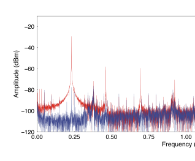

## BNC cables
A BNC cable, being a type of coaxial cable, comprises several components that work together to transmit signals effectively while minimizing interference. The key components of a BNC cable include:

1. 1. **Center Conductor**:
    - **Function**: It is the primary pathway for transmitting the electrical signal along the length of the cable.
    - **Material**: Usually made of copper or a copper alloy for efficient signal transmission.
2. **Dielectric Insulator**:
    - **Function**: It insulates the center conductor from the outer shield, maintaining the cable's characteristic impedance and preventing short circuits.
    - **Material**: Commonly made from plastic or foam.
3. **Shielding**:
    - **Function**: It protects the signal in the center conductor from external electromagnetic interference (EMI) and radio frequency interference (RFI). This shielding also minimizes signal leakage from the cable.
    - **Material**: Often composed of braided aluminum or copper, or a combination of metallic foil and braided wire.
4. **Outer Jacket**:
    - **Function**: It provides physical protection for the internal components of the cable, guarding against environmental factors like moisture, abrasion, and other physical stresses.
    - **Material**: Typically made from a durable plastic material.
5. **BNC Connector**:
    - **Pin Connector (Male Part)**: Connects to the center conductor and is responsible for transferring the signal to the equipment.
    - **Outer Coupling Mechanism (Bayonet Lock)**: Enables a quick and secure connection to equipment with a simple push and twist action. This feature is critical for ensuring a stable connection that is resistant to disconnection from movement or vibration.
    - **Connector Body**: Houses the pin and coupling mechanism, provides structural support, and ensures proper alignment during connection.
    - **Ferrule or Crimp Sleeve**: Used to mechanically secure the cable to the connector, ensuring a stable and durable connection.

The combination of these components in a BNC cable ensures efficient signal transmission with minimal loss and interference, making them suitable for applications in radio, television, and other electronic equipment where reliable signal integrity is crucial.

BNC cables come in two main impedance ratings: 50 ohms and 75 ohms. The choice between 50-ohm and 75-ohm BNC cables depends on the specific application and the equipment being used. Here's why BNC cables are usually designed with a 50-ohm impedance:
- In RF applications, a 50-ohm impedance is often preferred because it matches the characteristic impedance of many RF systems and components.
- A 50-ohm cable is designed to match the characteristic impedance of the equipment it connects to, minimizing signal reflections and ensuring better signal integrity. Mismatched impedance can lead to signal loss and distortions.

### impedance mismatch
Impedance mismatch occurs when there is a difference in the impedance (resistance to the flow of alternating current) between the source and the load in an electrical system. This mismatch can lead to various issues, including signal reflection, signal distortion, and power loss. Impedance matching is essential in many electronic systems to ensure optimal signal transfer and performance.

In the context of transmission lines, such as coaxial cables, the characteristic impedance of the cable should ideally match the impedance of both the source (transmitter) and the load (receiver) to prevent impedance mismatch. If there is a mismatch:
1. **Reflections:** When a signal encounters a change in impedance, a portion of the signal reflects back towards the source. This reflection can cause standing waves, leading to signal distortion and reduced overall efficiency.
2. **Signal Loss:** Impedance mismatch can result in a loss of power transfer between the source and the load. The greater the mismatch, the more significant the loss.
3. **Distortion:** Mismatched impedance can cause signal distortion, affecting the quality of the transmitted signal. This distortion may manifest as changes in amplitude, phase, or frequency response.
4. **Reduced Bandwidth:** Impedance mismatches can limit the usable bandwidth of a system, affecting its ability to transmit signals at higher frequencies.

In the case of BNC cables, as mentioned earlier, they are available in 50-ohm and 75-ohm configurations. It's important to use the appropriate impedance for the specific application to avoid impedance mismatch and its associated problems. Matching the impedance along the entire signal path, from source to load, helps maintain signal integrity and minimize issues related to reflections and signal loss.

## Magnetoresistance
### AMR (magnetic materials)
electrical resistance on the angle between the direction of electric current and direction of **magnetization** is observed.
$\rho=\rho_{perp}+(\rho_{parra}-\rho_{perp})cos^2(\varphi)$

### Lorenz Magnetoresistance
for non-magnetic materials.

Generally, the influence of in-plane B field on R is negligible.

## SU(2)
**spin** can be describe by SU(2) group
The property that a 360-degree rotation does not return a spin-1/2 particle (like an electron) to its original state, while a 720-degree rotation does, is a fascinating aspect of quantum mechanics and is a direct consequence of SU(2) symmetry.

rotational operator: $e^{-i\theta J\cdot n/\hbar}$
for spin, S = hbar/2 Pauli matrix
### Bloch sphere
Any two-level system can be described in Bloch sphere as psi = cos(theta/2) |0> + e^iphi sin(theta/2) |1>. The theta and phi form a Bloch sphere.

pure states are in the surface of Bloch sphere, while mixed states are inside of it.

## MoTe2
List of Transition metal:

a stable hexagonal semiconducting phase (2H) as well as two semimetallic phases with monoclinic (1T′) and orthorhombic (Td) structures

## QTM

Jiewen Xiao's Abstract at Tsinghua: 
Measuring the energy-momentum dispersion relation in quantum materials can provide key insights into their strongly correlated electronic phenomena. We have recently demonstrated a new type of a scanning probe microscope – the Quantum Twisting Microscope (QTM)1 – capable of measuring electrons in momentum space in a similar way to the way a scanning tunneling microscope (STM) measures electrons in real-space. The QTM is based on a van-der-Waals (vdW) heterostructure on a tip, which, when brought into contact with another vdW sample, **allows electrons to tunnel into it at many locations quantum coherently** With an extra twist degree of freedom, this microscope becomes a momentum-resolving local scanning probe. The first version of QTM operated at room temperature, and we demonstrated quantum coherence at the tip and directly image the energy bands of monolayer and twisted bilayer graphene1. **Recently, we generalized the QTM to cryogenic temperatures and use the QTM to image neutral excitations by the momentum resolved inelastic tunneling.**

## g-factor and Bohr magneton
$\mu=ge/2m_e S or L$
for electron spin, g=2, electron angular momentum, g=1

Bohr magneton $\mu_B=2*e/2m_e *\hbar/2$

## low temperature setup
2024/01/22 Jiaojie Yan
Superconducting wire + Cu/Ni. Block thermal conductivity

### Noise

50Hz period (the peaks in the spectrum)

## non Fermi Liquid
### Fermi liquid
Fermi liquid theory, which successfully describes most metals, is based on the assumption that the low-energy excitations (quasiparticles) in a metal can be thought of as non-interacting electrons, each carrying the same charge and spin as free electrons, but with possibly different effective masses due to interactions.

i.e., **interaction + electrons = non-interacting quasiparticles with e charge and spin 1/2**. e.g., metals
### non Fermi Liquid
Non-Fermi liquids, however, display behaviors that cannot be explained by this simple quasiparticle picture. These materials often emerge in systems with strong electron-electron interactions

i.e., **non FL = materials considering interactions**. 
e.g., high-temperature superconductors, heavy fermion compounds, and materials close to a quantum critical point, where the system undergoes a continuous phase transition at zero temperature under the variation of a parameter like pressure or magnetic field.
#### representative behavior
1. **Anomalous Temperature Dependence of Physical Properties:** Unlike Fermi liquids, where the resistivity varies as the square of the temperature **(T^2) at low temperatures**, non-Fermi liquids may exhibit linear temperature dependence of resistivity or other non-quadratic temperature dependencies in specific heat, magnetic susceptibility, and other thermodynamic and transport properties.
2. **Breakdown of the Quasiparticle Picture:** In Fermi liquids, low-energy excitations can be described as quasiparticles with well-defined momentum and energy. In non-Fermi liquids, these excitations may not have a simple quasiparticle description, leading to anomalous decay rates and a breakdown of the concept of a quasiparticle life time that makes sense.
3. **Strange Metal Behavior:** Non-Fermi liquids often exhibit "strange metal" behavior characterized by unconventional electrical resistivity and other transport properties that do not fit within the Fermi liquid framework. This includes non-trivial power law dependencies of various physical quantities on temperature and frequency.
     - One of the hallmark features of strange metals is that their electrical resistivity increases **linearly** with temperature over a wide range of temperatures (also, thermal/magnetic don't fit with metals)
     - Many strange metals are found in proximity to a quantum critical point (QCP), a point at absolute zero temperature where the material undergoes a continuous phase transition driven by quantum fluctuations rather than thermal fluctuations. The presence of a QCP affects the material's properties at finite temperatures and is believed to play a significant role in the emergence of strange metal behavior.
1. **Scaling Laws:** Close to a quantum critical point, non-Fermi liquid behavior can often be described by scaling laws that indicate a lack of a characteristic energy scale, in contrast to Fermi liquids which have a well-defined Fermi energy.

## Quantum Hall
### QH FM
In a quantum Hall ferromagnet, the electrons in the system not only exhibit the quantum Hall effect but also spontaneously magnetize without an external magnetic field due to their spin or pseudo-spin interactions.
1. **Spin Polarization**: The electrons in the system align their spins in the same direction, leading to magnetization. This alignment can be due to direct spin-spin interactions or due to interactions mediated by the system's lattice or electronic structure.
2. **Pseudo-spin Polarization**: In addition to actual spin, quantum Hall ferromagnets can involve pseudo-spins, which represent other degrees of freedom, such as different electronic subbands or layers in bilayer systems. Pseudo-spin ferromagnetism can arise from interactions that favor parallel alignment of these pseudo-spins.
3. **Skyrmions**: In some quantum Hall ferromagnets, the magnetization can form topologically nontrivial configurations called skyrmions. These are whirl-like structures in the spin field that have unique physical properties and are of great interest for information storage and manipulation.
4. it is most commonly discussed in the context of the lowest Landau level (LLL) or the first excited Landau level. 
     - filling factor = 1: spins aligned due to exchange interactions, leading to a fully spin-polarized state. This is perhaps the simplest example of a quantum Hall ferromagnet.
     - filling factor = 1/m: spins aligned due to exchange interactions, leading to a fully spin-polarized state. This is perhaps the simplest example of a quantum Hall ferromagnet.
     - **Bilayer Systems at Total Filling Factor �=1ν=1**: In bilayer quantum Hall systems, quantum Hall ferromagnetism can also occur when the total filling factor of both layers is one. Here, the system may favor a pseudo-spin ferromagnetic state, where the pseudo-spin represents the layer degree of freedom, and electrons prefer to be in a parallel spin configuration across the two layers.
     - **Higher Landau Levels**: While less common, quantum Hall ferromagnetism can also occur at higher Landau levels under certain conditions. The physics becomes more complex due to the increased role of the Coulomb interaction's form factors, leading to different kinds of ferromagnetic and even antiferromagnetic states.

